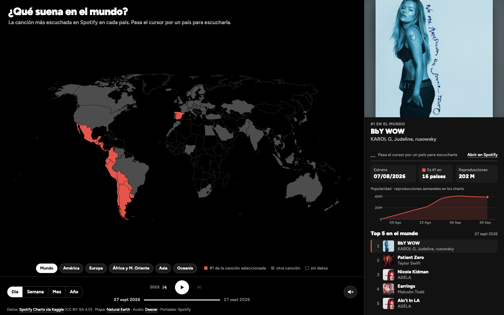
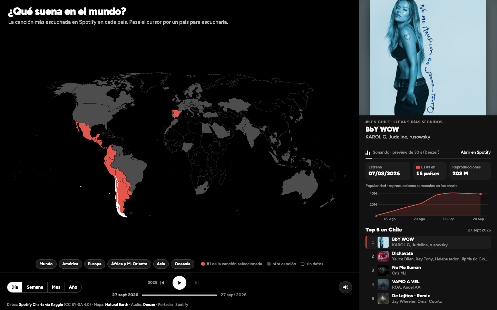
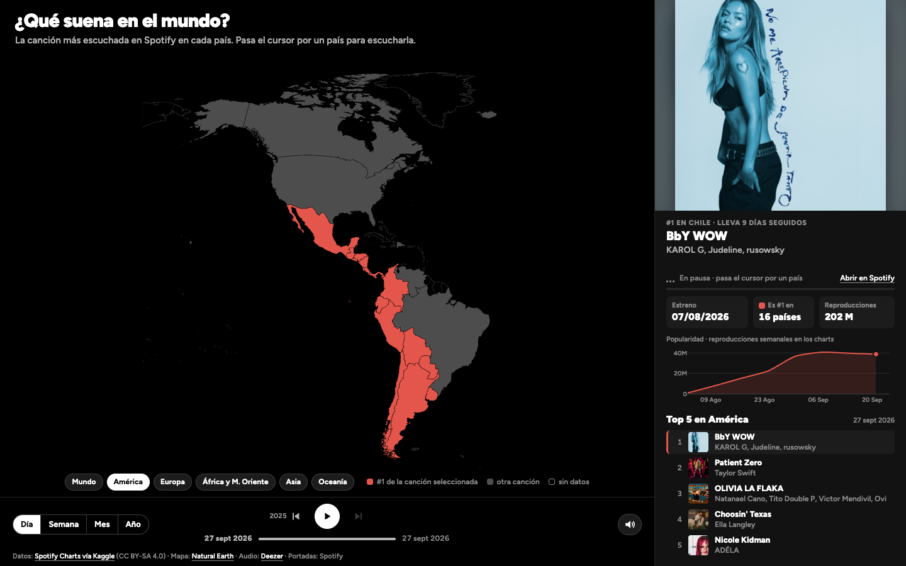
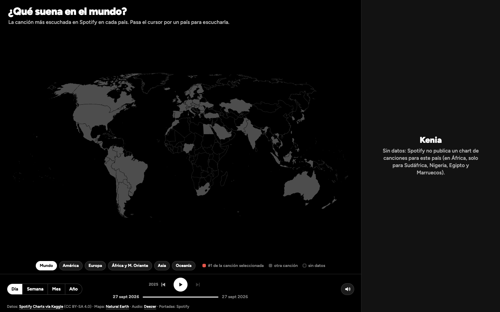

# V1 — La idea completa

> Registro de versión según la pauta E1 (sección 5). Lo marcado con **[COMPLETAR]** lo tiene que escribir o revisar el grupo.

## Identificación

| Campo | Valor |
|---|---|
| Versión | V1 |
| Fecha | 2 de octubre de 2026 |
| Tag / commit | [`v1`](https://github.com/IgnOsorioo/Proyecto-InfoVis/releases/tag/v1) → commit `ead22c5` |
| Ver en línea | https://ignosorioo.github.io/Proyecto-InfoVis/v1/ |

## Evidencia visual y sonora

| | |
|---|---|
|  |  |
| Vista general: el #1 del mundo y en coral los países donde también es #1. | Cursor sobre Chile: suena su #1 y el panel muestra portada, estadísticas, popularidad y top 5. |
|  |  |
| Botón de región: encuadra el continente completo. | País sin chart de Spotify: el panel muestra solo el mensaje. |

Versión móvil: [evidencia/05-movil.png](evidencia/05-movil.png).

**Video con audio: [COMPLETAR].** Grabar 30–60 s con QuickTime u OBS y subirlo a YouTube (no listado). Las capturas no registran el sonido, así que el video lo tiene que grabar el grupo. Recorrido sugerido:
1. Activar sonido.
2. Pasar el cursor por Chile y Argentina: misma canción, el audio sigue sin cortarse.
3. Pasar a EE.UU.: la canción cambia.
4. Pasar por Kenia: aparece el mensaje "sin datos".
5. Botón Europa.
6. Play de la línea de tiempo, para ver cómo crece el gráfico de popularidad.

## Qué cambió (en V1: las decisiones iniciales) — máx. 8 líneas

1. Datos: Top 200 diario de Spotify, 70 países + global, enero 2017 a septiembre 2026. Se trabaja por país, porque no hay histórico por ciudad.
2. Forma visual: mapa mundial 2D (Natural Earth). En coral, los países donde la canción seleccionada es #1; en gris, los que tienen otro #1; solo contorno, los sin datos.
3. Interacción: al pasar el cursor por un país, su #1 pasa a ser la canción seleccionada. Hay botones de región, línea de tiempo con saltos de año y granularidad día/semana/mes/año.
4. Detalle: panel lateral con portada, estreno, en cuántos países es #1, reproducciones, popularidad semanal y top 5 del país, continente o mundo.
5. Sonido: suena el preview de 30 s (Deezer) del #1 del país bajo el cursor.
6. Estilo: fondo negro, un solo color de acento (coral) y tipografía Figtree.

## Por qué — el rationale (máx. 12 líneas) — **[REVISAR Y AJUSTAR CON PALABRAS DEL GRUPO]**

- **Mantra de Shneiderman.**
  - *Overview:* el mapa 2D muestra los 70 países a la vez.
  - *Zoom & filter:* regiones, granularidad y línea de tiempo.
  - *Details on demand:* el cursor sobre un país abre su detalle en el panel.
- **Atributo preatentivo.** Un único color de acento (coral) sobre grises neutros hace que los países donde manda la canción seleccionada "salten" a la vista. El coral está validado para contraste y daltonismo.
- **Relleno vs. contorno.** Separa "otra canción" de "sin datos". En una iteración intermedia ambos eran grises y, en una revisión interna del grupo, leímos que India no tenía datos, cuando sí los tenía.
- **El dato se escucha sin explicación.** El sonido es la propia canción #1. Al pasar a un país con el mismo #1, el audio no se corta, y eso agrupa a los países que comparten canción.
- **Panel estable.** El panel tiene bloques de alto fijo y se arma de una sola vez, para que la atención no se vaya a saltos de layout.

## Qué se descartó (máx. 5 líneas)

- **Primer prototipo:** gráfico de dispersión "¿explotan o viajan?" con sonido sintético (Tone.js). Se descartó porque el grupo eligió centrar la experiencia en el mapa y en escuchar la canción real.
- **Globo ortográfico** (commit `41c7dc5`): oculta medio mundo y rompe el *overview*, así que se volvió al 2D.
- **Tres colores para "las más compartidas"** (commit `1aa00f8`): necesitaban una leyenda propia que competía con el panel.
- **Datos por ciudad:** no hay histórico público, y descargarlos con una cuenta de Spotify infringe sus condiciones de uso.
