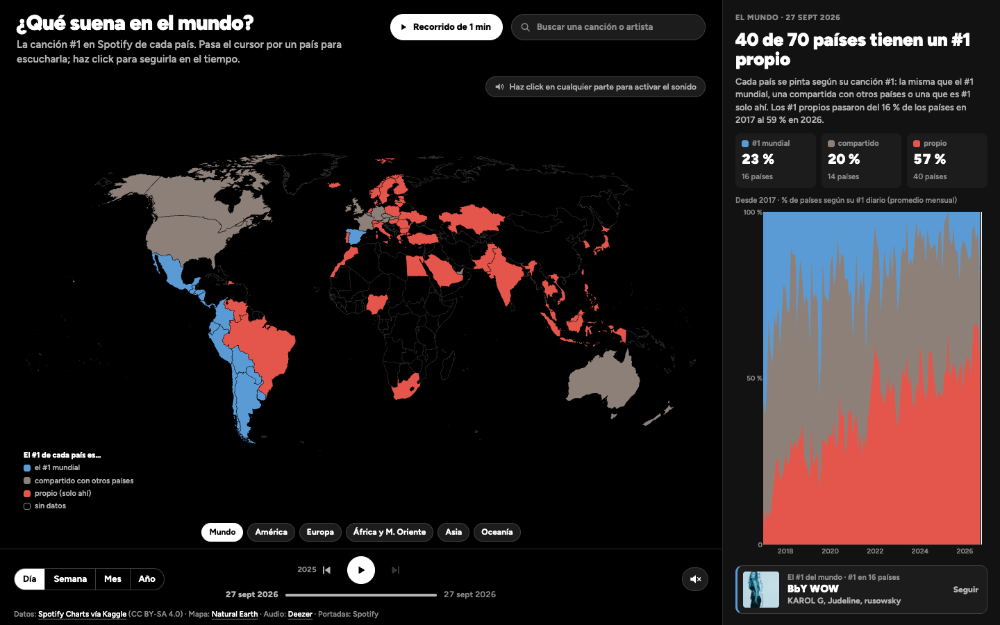
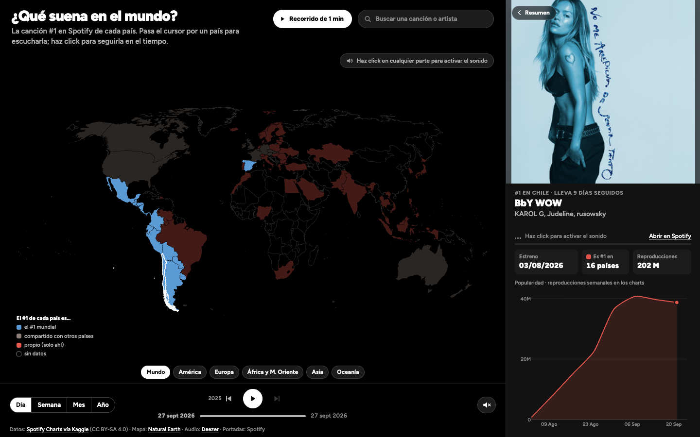
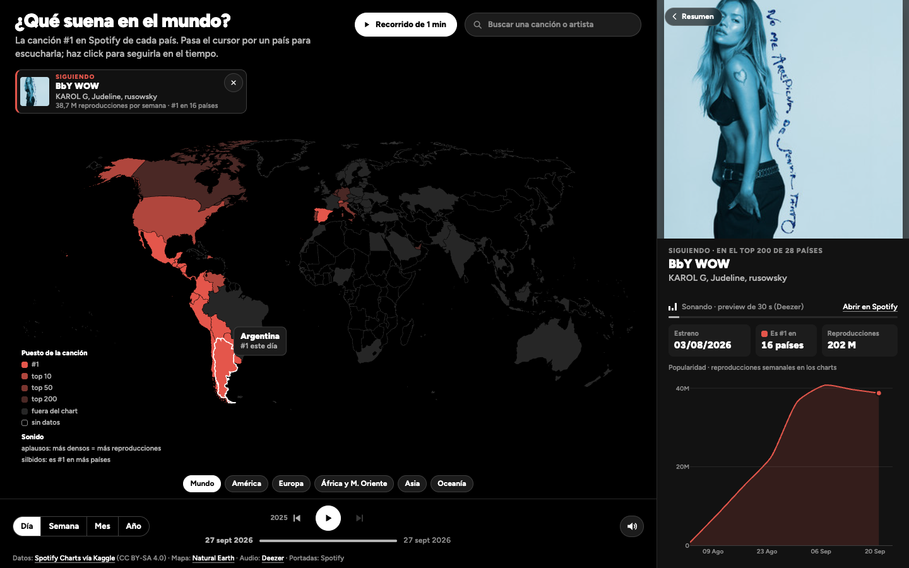
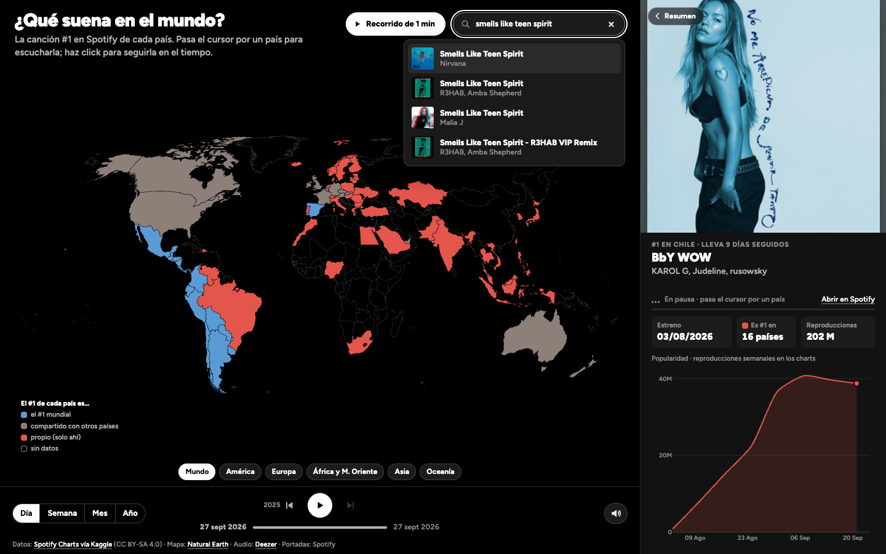
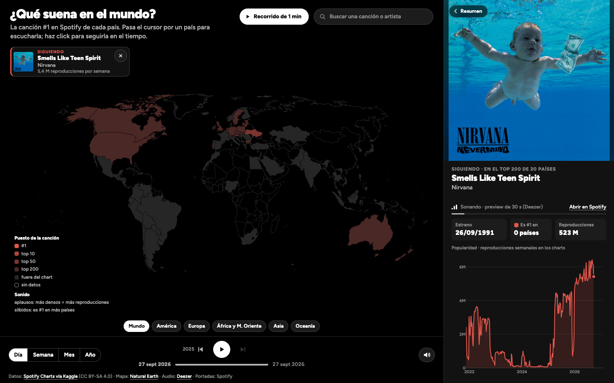
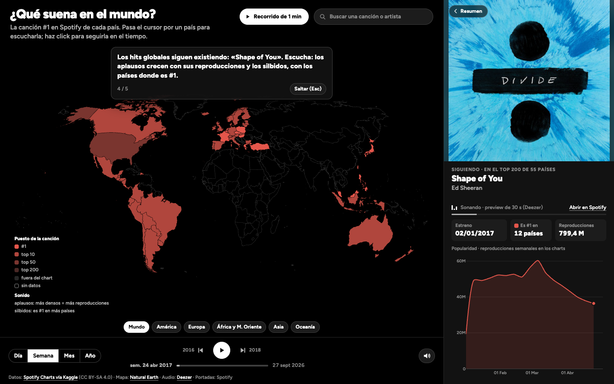

# V2 — Primera iteración de diseño

> Registro de versión según la pauta E1 (sección 5). Lo marcado con **[COMPLETAR]** lo tiene que escribir o revisar el grupo. Los cambios responden a la [R1](../readmes/R1-equipo-docente.md) (profesor), que observó tres cosas:
> - una sonificación pobre: el sonido era el dato mismo;
> - una interacción que recién empezaba tras un click;
> - un panel que cambiaba al llevar el cursor hacia él.

## Identificación

| Campo | Valor |
|---|---|
| Versión | V2 |
| Fecha | 8 de octubre de 2026 (para la R2) |
| Tag / commit | `v2` (ver los tags del repositorio) |
| Ver en línea | https://ignosorioo.github.io/Proyecto-InfoVis/v2/ |

## Evidencia visual y sonora

| | |
|---|---|
|  |  |
| Al entrar: cada país según su #1 (mundial, compartido o propio) y el resumen del mundo desde 2017. Nada que cerrar. | Cursor sobre Chile: su #1 suena y se ve en el panel. Quedan plenos solo los países que comparten ese #1. |
|  |  |
| Click: se sigue la canción. El mapa pinta su puesto en cada país y el globo da el detalle. | Buscador de las 250.790 canciones que entraron al Top 200 de algún país. |
|  |  |
| Una canción antigua que volvió a los charts: *Smells Like Teen Spirit* (1991) en el top 200 de 20 países en 2026. | Recorrido de 1 minuto: de 2017 a hoy y un hit global con sus aplausos. |

Versión móvil: [evidencia/07-movil.png](evidencia/07-movil.png).

**Video con audio: [COMPLETAR].** Grabar con QuickTime u OBS. Los aplausos son lo central de esta versión, así que el video tiene que tener sonido. La forma más simple es grabar el botón **"Recorrido de 1 min"** de principio a fin y después mostrar a mano:
1. Pasar el cursor por Chile y luego por Brasil: cambia la canción y se atenúan los países que no comparten el #1.
2. Buscar una canción de nicho (por ejemplo, "El baile de los que sobran"): aplausos sueltos y sin silbidos.
3. Esc para volver al resumen.

## Qué cambió respecto a V1 (máx. 8 líneas)

1. **Vista general con mensaje.** El mapa pinta el #1 de cada país como mundial (azul), compartido (gris cálido) o propio (coral). El panel parte con el resumen del mundo o de la región, y con la evolución desde 2017.
2. **Sin ventana inicial.** Todo se explora al entrar; el sonido se activa con el primer click o tecla, sin bloquear nada.
3. **Pasar el cursor muestra, click fija.** Hay que detenerse sobre un país para elegirlo. Al salir del mapa, el panel se queda con el último país.
4. **Seguir una canción** (click en un país, en "El #1 del mundo" o en el buscador). El mapa pinta su puesto en cada país (#1, top 10, top 50, top 200 o fuera del chart). Un indicador dice qué canción se sigue; se sale con ✕ o Esc.
5. **Sonificación de datos.** Aplausos sintetizados:
   - su densidad (ritmo) sigue las reproducciones semanales;
   - en los niveles altos se suma el murmullo de un estadio (timbre);
   - los silbidos indican en cuántos países es #1;
   - fuera de los charts, silencio.
6. **Buscador con el catálogo completo:** las 250.790 canciones que entraron al Top 200 de algún país desde 2017, con su puesto semanal por país (`scripts/06_catalogo_completo.py`).
7. **Sin top 5**, y con un **recorrido guiado de 1 minuto** que cuenta el mensaje solo.

## Por qué cambió — el rationale (máx. 12 líneas)

- **R1 → Shneiderman.** "Overview first": la V1 escondía el panorama detrás de un click. Ahora el mapa y el panel cuentan algo apenas se entra. El zoom y el filtro son las regiones y el tiempo, y el detalle llega a pedido con el cursor o el click.
- **R1 → sonificación.** El profesor pidió jugar con intensidad y frecuencia.
  - **Lo que decidió el grupo:** cambiarle el tono o el timbre a la canción deformaría el dato, así que la canción queda intacta como identidad.
  - **La capa nueva:** los aplausos codifican la popularidad con ritmo (densidad) y timbre, no solo con volumen.
  - **La escala:** es logarítmica, porque las reproducciones van de mil a 116 M por semana.
  - **Por qué aplausos:** son una metáfora conocida de éxito, así que se entienden sin explicación.
- **R1 → error del panel.** "Pasar muestra, click fija", más la espera de 140 ms, evita que el panel cambie al cruzar países. Esc y ✕ dan una salida explícita (control del usuario).
- **Datos → color de la vista general.** El hallazgo, con el mismo cálculo que muestra el panel (todos los países con chart, promedio de cada año):
  - el #1 mundial era #1 en el 40 % de los países en 2017 y en el 11 % en 2026;
  - los #1 propios pasaron del 16 % al 59 %.

  Las categorías van de lo global a lo local, con una escala divergente azul–gris–coral. El coral, preatentivo, marca lo propio, que es lo que crece.
- **Seguir.** Rampa secuencial de coral con luminosidad decreciente según el puesto, porque el puesto es un dato ordinal.
- **Menos es más.** El top 5 competía con el #1, que es el dato del mensaje, así que se quitó. El espacio pasó al gráfico de popularidad y a la evolución desde 2017.

## Qué se descartó (máx. 5 líneas)

- **Efectos sobre la canción** (tono, filtro, velocidad): deforman el dato. Decisión del grupo tras la R1.
- **Capa sintética abstracta para la vista general** (un acorde que pasa del unísono a un racimo de notas): se prefirieron los aplausos, una metáfora más directa.
- **Datasets históricos en esta versión** (por ejemplo, charts de radio desde los 80): no alcanzaba el tiempo para integrarlos bien. Quedan para la V3.
- **Opacidad por país para atenuar:** Plotly no la permite en mapas coropléticos. Se usaron versiones oscurecidas de cada color.
- **Top 5 por país, continente y mundo:** desviaba la atención del #1.
